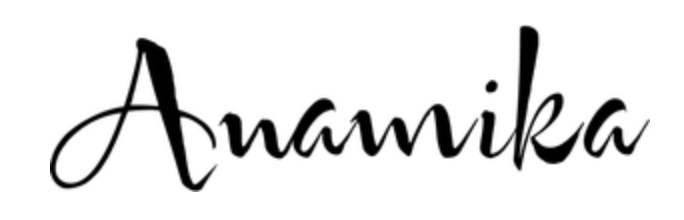

//# Business-Website
<html>
<head>
<title>Business website</title>
<link rel = "stylesheet" href = "stile.css">
<link rel="stylesheet" href="https://stackpath.bootstrapcdn.com/bootstrap/4.5.0/css/bootstrap.min.css">
<link rel="stylesheet" href="https://stackpath.bootstrapcdn.com/font-awesome/4.7.0/css/font-awesome.min.css">

</head>
<body>

<!----NavigationBar---->
<section id="nav-bar">
<nav class="navbar navbar-expand-lg navbar-light">
  
  <button class="navbar-toggler" type="button" data-toggle="collapse" data-target="#navbarNav" aria-controls="navbarNav" aria-expanded="false" aria-label="Toggle navigation">
    
  </button>
  

    <ul class="navbar-nav ml-auto">
      <li class="nav-item">
        <a class="nav-link" href="#">DASHBOARD</a>
      </li>
      <li class="nav-item">
        <a class="nav-link" href="#about">ABOUT US</a>
      </li>
      <li class="nav-item">
        <a class="nav-link" href="#services">SERVICES</a>
      </li>
      <li class="nav-item">
        <a class="nav-link" href="#team">OUR TEAM</a>
      </li>
    <li class="nav-item">
        <a class="nav-link" href="#price">PRICE PLANS</a>
      </li>
<li class="nav-item">
        <a class="nav-link" href="#testimonials">TESTIMONIALS</a>
      </li>
<li class="nav-item">
        <a class="nav-link" href="#contact">CONTACT</a>
      </li>
   </ul>
  

</nav>
</section>
   <!-----------Slider--------->

  <ol class="carousel-indicators">
    <li data-target="#headerSlider" data-slide-to="0" class="active"></li>
    <li data-target="#headerSlider" data-slide-to="1"></li>
    <li data-target="#headerSlider" data-slide-to="2"></li>
  </ol>
  

    

      
    

        <h5>How to make a Website</h5>
    

    

      
       

        <h5>Create Responsive Website</h5>
    
    

    

      
    

        <h5>Business Website Design</h5>
    

  

  <a class="carousel-control-prev" href="#headerSlider" role="button" data-slide="prev">
    
    Previous
  </a>
  <a class="carousel-control-next" href="#headerSlider" role="button" data-slide="next">
    
    Next
  </a>

<!----------About----------->
<section id = "about">
                            

                                            

           <h2>About Us</h2>
                  

                Hello Everyone , my name is Anamika Kashyap, i am a student of computer science branch,
                I am currently persuing my B.Tech from Ambalika Institute of management and technology.
                I have a lot interest in Web Development . I have created this Business Website myself 
                for further progress and development of my skills . I hope you will like it. Thankyou :)
                  

                <button type = "button" class="btn btn-primary">Read more>>
                </button>

                 
HTML

                 

                    
80

                 

                 
CSS

                 

                    
85

                 

                 
JAVASCRIPT

                 

                    
75

                 

 
                 
WordPress

                 

                    
50

                 

                                            

                            

</section>
<!----------Services-------------->
<section id="services">
                

                <h1>Our Services<h1>
                       

                             

                                  

                                        <i class="fa fa-desktop"></i>
                                      
 
                                        <h3>Web Development</h3>
                                        
Lorem ipsum,
                                           or lipsum as it is sometimes known,
                                           is dummy text used in laying out print,
                                         

                              

                             

                                  

                                        <i class="fa fa-tablet"></i>
                                      
 
                                        <h3>App Development</h3>
                                        
Lorem ipsum,
                                           or lipsum as it is sometimes known,
                                           is dummy text used in laying out print,
                                         

                              

                             

                                  

                                        <i class="fa fa-line-chart"></i>
                                      
 
                                        <h3>Digital Marketing</h3>
                                        
Lorem ipsum,
                                           or lipsum as it is sometimes known,
                                           is dummy text used in laying out print,
                                         

                              

                             

                                  

                                        <i class="fa fa-paint-brush"></i>
                                      
 
                                        <h3>Graphics Designing</h3>
                                        
Lorem ipsum,
                                           or lipsum as it is sometimes known,
                                           is dummy text used in laying out print,
                                         

                              

                
                        

                 

</section>
<!---------------Team Members------------------>
<section id="team">
     

     <h1>Our Team</h1>
        

            

                  

                  
                      <ul>
                          <a href="#"><li><i class="fa fa-facebook"></i></li></a>
                          <a href="#"><li><i class="fa fa-twitter"></i></li></a>
                          <a href="#"><li><i class="fa fa-linkedin"></i></li></a>
                      </ul>
                  

                         <h2>Anamika Kashyap</h2>
                         <h3>Founder / CEO</h3>
                         
If you like this page then give your comments

            

            
            

                  

                  
                      <ul>
                          <a href="#"><li><i class="fa fa-facebook"></i></li></a>
                          <a href="#"><li><i class="fa fa-twitter"></i></li></a>
                          <a href="#"><li><i class="fa fa-linkedin"></i></li></a>
                      </ul>
                  

                         <h2>Alia Bhatt</h2>
                         <h3>Business Head</h3>
                         
If you like this page then give your comments

            

            

                  

                  
                      <ul>
                          <a href="#"><li><i class="fa fa-facebook"></i></li></a>
                          <a href="#"><li><i class="fa fa-twitter"></i></li></a>
                          <a href="#"><li><i class="fa fa-linkedin"></i></li></a>
                      </ul>
                  

                         <h2>Siddharth Malhotra</h2>
                         <h3>Marketing Head</h3>
                         
If you like this page then give your comments

            

            

                  

                  
                      <ul>
                          <a href="#"><li><i class="fa fa-facebook"></i></li></a>
                          <a href="#"><li><i class="fa fa-twitter"></i></li></a>
                          <a href="#"><li><i class="fa fa-linkedin"></i></li></a>
                      </ul>
                  

                         <h2>Varun Dhawan</h2>
                         <h3>UI Designer</h3>
                         
If you like this page then give your comments

            

        

     

</section>
<!------------promo---------------->
   <section id="promo">
     

       
Get free domain name and Web Hosting

       <a href = "#" class = "btn btn-primary">Contact Us</a>
     

   </section>
<!-------------Price plans------------>
<section id = "price">
  

    <h1>Price Plans</h1>
    

    

      

      

        <h2>Free</h2>
        
$0/month

      

      

        <ul>
          <li><i class="fa fa-check-circle"></i>5GB Space</li>
          <li><i class="fa fa-check-circle"></i>10GB Bandwidth</li>
          <li><i class="fa fa-times-circle"></i>15 Email Account</li>
          <li><i class="fa fa-times-circle"></i>Unlimited Domain</li>
          <li><i class="fa fa-times-circle"></i>Unlimited Support</li>
        </ul>
      

      

      <a class="buy-btn" href="#">Join Free</a>
      

      

    

    

      

      

        <h2>Start up</h2>
        
$10/month

      

      

        <ul>
          <li><i class="fa fa-check-circle"></i>10GB Space</li>
          <li><i class="fa fa-check-circle"></i>100GB Bandwidth</li>
          <li><i class="fa fa-check-circle"></i>15 Email Account</li>
          <li><i class="fa fa-times-circle"></i>Unlimited Domain</li>
          <li><i class="fa fa-times-circle"></i>Unlimited Support</li>
        </ul>
      

      

      <a class="buy-btn" href="#">Buy Now</a>
      

      

    

    

      

      

        <h2>Business Plan</h2>
        
$50/month

      

      

        <ul>
          <li><i class="fa fa-check-circle"></i>20GB Space</li>
          <li><i class="fa fa-check-circle"></i>200GB Bandwidth</li>
          <li><i class="fa fa-check-circle"></i>50 Email Account</li>
          <li><i class="fa fa-check-circle"></i>Unlimited Domain</li>
          <li><i class="fa fa-times-circle"></i>Unlimited Support</li>
        </ul>
      

      

      <a class="buy-btn" href="#">Buy Now</a>
      

      

    

    

      

      

        <h2>Advanced</h2>
        
$100/month

      

      

        <ul>
          <li><i class="fa fa-check-circle"></i>20GB Space</li>
          <li><i class="fa fa-check-circle"></i>Unlimited Bandwidth</li>
          <li><i class="fa fa-check-circle"></i>Unlimited Account</li>
          <li><i class="fa fa-check-circle"></i>Unlimited Domain</li>
          <li><i class="fa fa-check-circle"></i>Unlimited Support</li>
        </ul>
      

      

      <a class="buy-btn" href="#">Buy Now</a>
      

      

    

    
  
 

</section>

<!------------Testiminials--------------->
<section id = "testimonials">
    

      <h1>Testimonials</h1>
      
Subscribe Our Website to get latest updates

    

    

      

        

        <blockquote>Lorem ipsum dolor sit amet,
                consectetur adipiscing elit,
                sed do eiusmod tempor incididunt ut labore et dolore magna aliqua. 
                Ut enim ad minim veniam,
                quis nostrud exercitation ullamco laboris nisi ut aliquip ex ea commodo consequat.
       </blockquote>
        <h3>Anju Choudhary Co Founder at XYZ</h3>
        

      

        

        <blockquote>Lorem ipsum dolor sit amet,
                consectetur adipiscing elit,
                sed do eiusmod tempor incididunt ut labore et dolore magna aliqua. 
                Ut enim ad minim veniam,
                quis nostrud exercitation ullamco laboris nisi ut aliquip ex ea commodo consequat.
        </blockquote>
        <h3>Anamika Kashyap Founder /CEO at XYZ</h3>
        

      

        

        <blockquote>Lorem ipsum dolor sit amet,
                consectetur adipiscing elit,
                sed do eiusmod tempor incididunt ut labore et dolore magna aliqua. 
                Ut enim ad minim veniam,
                quis nostrud exercitation ullamco laboris nisi ut aliquip ex ea commodo consequat.
        </blockquote>
        <h3>Aparna Srivastava Manager at XYZ</h3>
        

      

      

    

</section>
<!-------------Get in Touch----------------->
<section id = "contact">
  

  <h1>Get in touch</h1>
    

      

        <form class ="contact-form">
        

        <input type ="text" class ="form-control" placeholder ="Your-name">
        

        
        

        <input type ="number" class ="form-control" placeholder ="Phone no.">
        

        

        <input type ="email" class ="form-control" placeholder ="Email id">
        

        

        <textarea class ="form-control" rows="4" placeholder ="Your-Message"></textarea>
        

        <button type = "submit" class ="btn btn-primary">SEND MESSAGE</button>

        </form>
      

       

         
<b>Address:</b><i class="fa fa-map-marker"></i>XYZ Road, Thakurganj, Lucknow India

         
<b>Phone:</b><i class="fa fa-phone"></i>+1 1234567890

         
<b>Email:</b><i class="fa fa-envelop-o"></i>anamika@website.com

         
<label><b>Get social:</b></label>
          <a href = "#"><i class="fa fa-facebook"></i></a> 
          <a href = "#"><i class="fa fa-youtube-play"></i></a> 
          <a href = "#"><i class="fa fa-twitter"></i></a> 
          <a href = "#"><i class="fa fa-google-plus"></i></a> 
         

      
       

    

  

</section>
                      <!--------------Footer------------>
<section id = "footer">

  
Made With <i class="fa fa-heart-o"></i> by Anamika Kashyap

</section>
<!------------footer end--------------->

</body>
</html>

